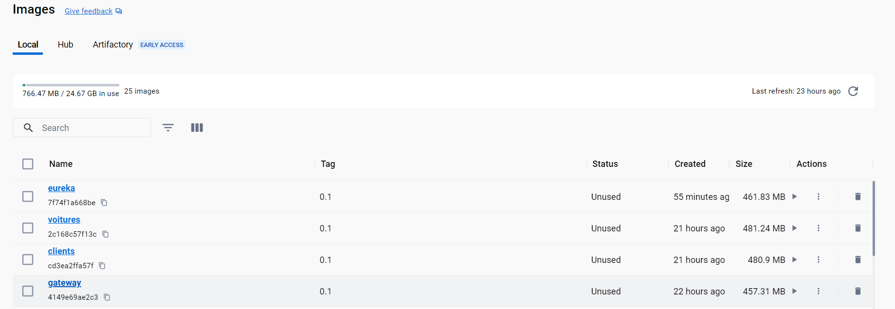
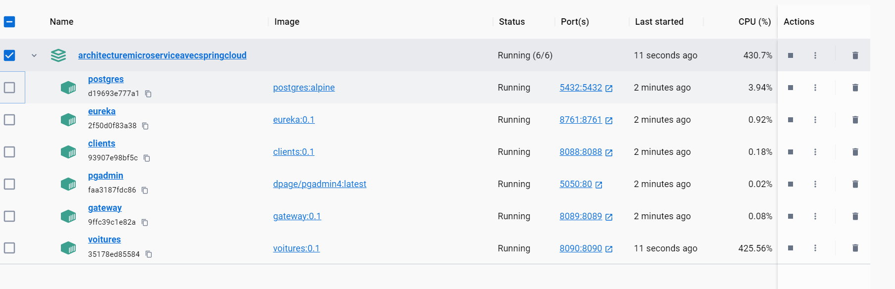
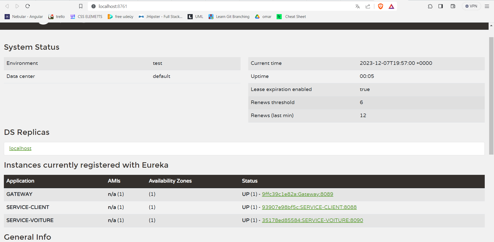
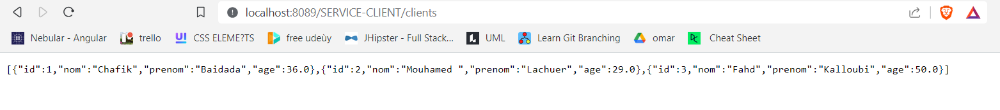
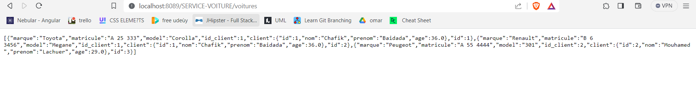

# Architecture_Microservices_SpringCloud

# Requirement :
Java 17 + docker

# Project Overview:

This Spring Boot-based microservices project comprises two microservices, namely clients and voitures. The voitures service can communicate with the clients service using the Feign client. Additionally, there's an Eureka server and a gateway (Eureka Gateway) that manage service registration and API routing, respectively. All components of this project are containerized using Docker.

# Key Components:

1) Microservices:

- Clients Service: A microservice handling client-related functionalities.
- Voitures Service: A microservice capable of communicating with the Clients service via the Feign client.

2) Eureka Server and Gateway:

 - Eureka Server:Responsible for service registration and discovery.
 - Gateway (Eureka Gateway):Manages API routing and acts as a gateway to the microservices.
3) Databases:Each microservice (clients and voitures) utilizes its own PostgreSQL database instance.

# Global Architecture :

# Follow this steps to setup  the project :
1)  open your terminal and clone this project
2)  generate the docker image for eureka server 
    - go inside the eureka server project 
    >cd "Architecture Micro Service avec Spring Cloud/"Eureka server""
    - package eureka server app into an executable jar using your editor or by typing :
    >mvn package 

    

    - build a docker image from this jar file by typing:
    > docker build -t eureka:0.1 .
    - check your docker images by typing in your cmd:
    > docker images 
    
    
    + know we have a docker image for our  eureka server  application
    
3)   generate the docker image for the API GATEWAY 
     - go inside the Gateway project
    
     - package gateway  app into an executable jar using your editor or by typing :
     > mvn package
     - build a docker image from this jar file by typing:
     > docker build -t gateway:0.1
     - check your docker images by typing in your cmd:
     > docker images
     + know we have a docker image for our  API GATEWAY  application
4) generate the docker image for the service client 
    - go inside the ServiceClient Folder and package the app into an executable jar using your editor or by typing :
    > mvn package
    - build a docker image from this jar file by typing:
     > docker build -t clients:0.1
    - check your docker images by typing in your cmd:
     > docker images
   + know we have a docker image for our  service client  application
5) generate the docker image for the service voiture:
    - go inside the voiture Folder and package the app into an executable jar using your editor or by typing :
   > mvn package
    - build a docker image from this jar file by typing:
   > docker build -t voitures:0.1
    - check your docker images by typing in your cmd:
   > docker images
    + know we have a docker image for our  service voiture  application
    
# Run the project :
1) before you try to run the project ensure you have compleshed the previous steps and you have this 4 docker images :

2) go to the root folder of the project "Architecture Micro Service avec Spring Cloud" where the docker-compose.yaml file is located 
2) type :
  > docker compose up

- this will take time if you don't have the postgres and the pgadmin docker images in your machine , docker will start pulling them 

4) you will find 5 docker container running like this image from docker desktop shows: 

5) go to the ui of eureka server , you will find 3 instances :

6) so all is good know  we have to test our two services by going to :
- 
- 