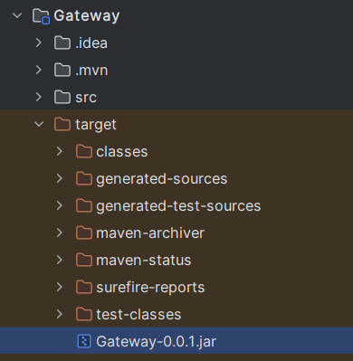

# Architecture_Microservices_SpringCloud

# Requirement :
Java 17 + docker 
# Follow this steps to run the project lcoally
1)  open your terminal and clone this project
2)  generate the docker image for eureka server 
    - go inside the eureka server project 
    >cd "Architecture Micro Service avec Spring Cloud/"Eureka server""
    - package eureka server app into an executable jar using your editor or by typing :
    >mvn package 

    

    - build a docker image from this jar file by typing:
    > docker build -t eureka:0.1 .
    - check your docker images by typing in your cmd:
    > docker images 
    
    
    + maintenaant on a une image docker d' eureka server 
    
3)   generate the docker image for the API GATEWAY 
     - go inside the Gateway project
    
     - package gateway  app into an executable jar using your editor or by typing :
     >mvn package

    

     - build a docker image from this jar file by typing:
    
     - check your docker images by typing in your cmd:
     > docker images
     + maintenaant on a une image docker d' eureka server
       
    